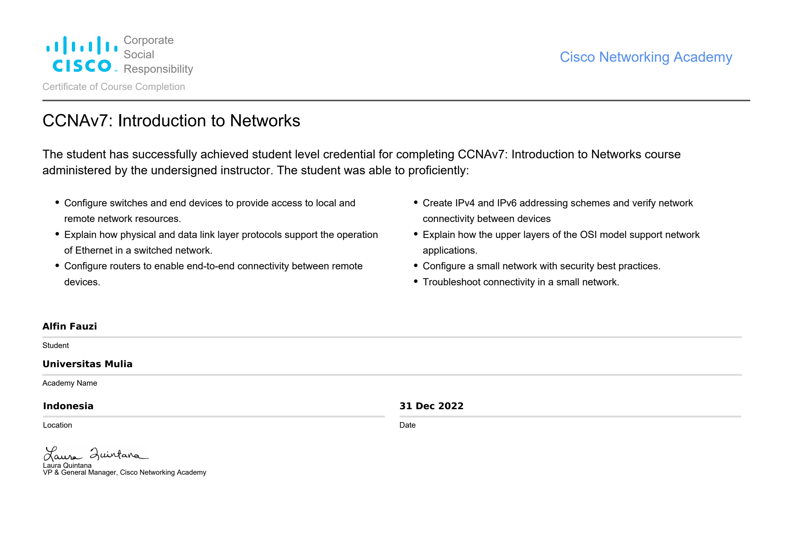

# Sertifikat CCNAv7: Introduction to Networks

## Informasi Umum

| Item | Detail |
|------|--------|
| **Nama Program** | Cisco Networking Academy |
| **Kursus** | CCNAv7: Introduction to Networks |
| **Nama Peserta** | Alfin Fauzi |
| **Institusi** | Universitas Mulia |
| **Lokasi** | Indonesia |
| **Tanggal** | 31 Desember 2022 |
| **Penandatangan** | Laura Quintana (VP & General Manager, Cisco Networking Academy) |

## Kompetensi yang Dicapai

1. **Konfigurasi Jaringan Dasar**
   - Mengonfigurasi *switch* dan *end devices* untuk menyediakan akses ke sumber daya jaringan lokal dan jarak jauh

2. **Protokol Lapisan Fisik & Data Link**
   - Menjelaskan bagaimana protokol lapisan fisik dan *data link* mendukung operasi Ethernet dalam jaringan *switched*

3. **Routing**
   - Mengonfigurasi *router* untuk memungkinkan konektivitas *end-to-end* antar perangkat jarak jauh

4. **Skema Pengalamatan IPv4 & IPv6**
   - Membuat skema pengalamatan IPv4 dan IPv6 serta memverifikasi konektivitas antar perangkat

5. **Model OSI**
   - Menjelaskan bagaimana lapisan atas model OSI mendukung aplikasi jaringan

6. **Keamanan & Troubleshooting**
   - Mengonfigurasi jaringan skala kecil dengan praktik keamanan terbaik
   - Melakukan *troubleshooting* konektivitas dalam jaringan skala kecil
